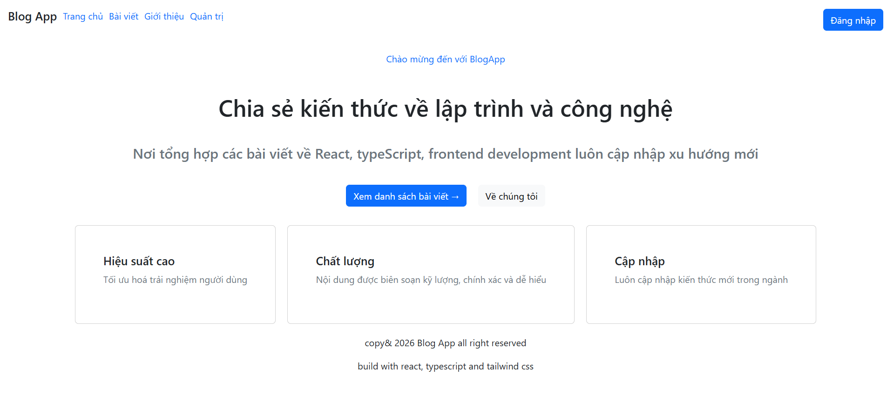
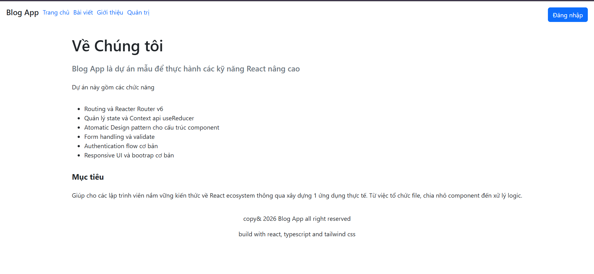
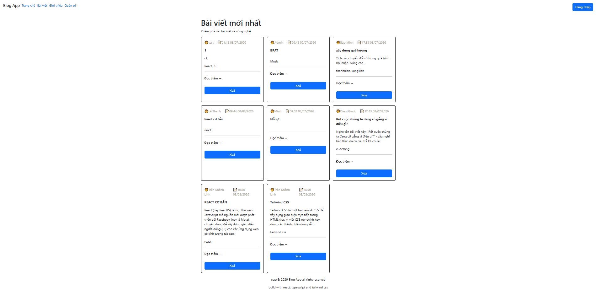
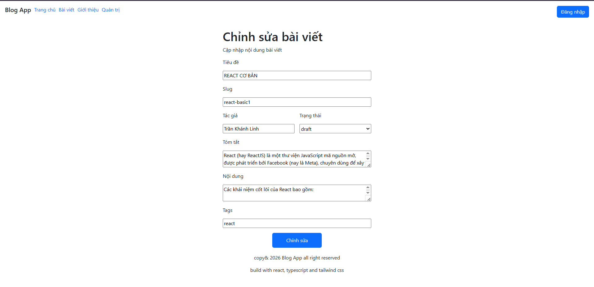
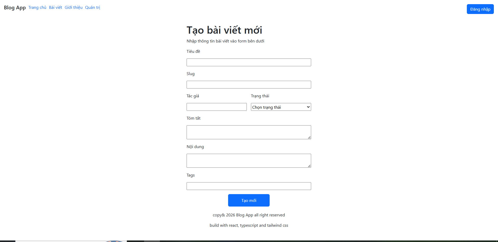
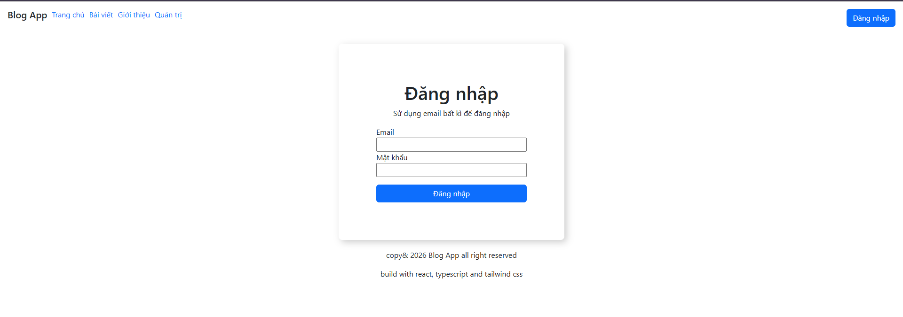
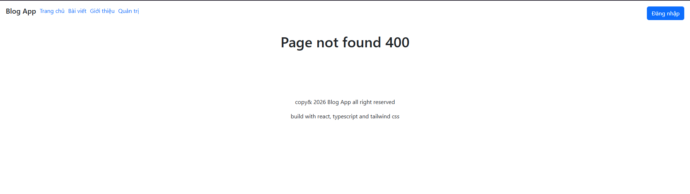

# Blog App
Dự án đăng blog app tiện dùng.
## Screenshot

## Feature
- AboutPage.jsx
- HomePage.jsx
- NotFoundPage.jsx
- PostCreatePage.jsx
- PostEditPage.jsx
- PostDetailPage.jsx
- PostListPage.jsx
## 🛠 Tech Stack
- Node.js, React
- Bootstrap, CSS
- Javascript HTML
## Run App
- npm install
- npm run dev
## Link API
(https://post365-api.onschoolbootcamp.edu.vn/posts/)
## Link demo
(https://6a771a75da82b4b954adbe7e--glistening-cuchufli-6ee5e0.netlify.app/)
## Case Study
 ### Điểm kỹ thuật chính:
  ಥ_ಥ Bài toán: 
  - Ban đầu các component ở dạng hardcode không được linh hoạt.
  - Lặp lại code khá nhiều, truyền prop thông qua nhiều component gây mất thời gian.
  - Cách trình bày component khá rối.

  Giải pháp tổng thể: 
  - Dùng context, outlet để truyền phần tử cũng như action để dễ tái sử dụng. 
  - Xây dựng atomic design để dễ quản lý code.

  Kỹ thuật chính:
  - Context để tạo các action,  tái sử dụng được, ngắn gọn.
  - useParam để lấy id từ fetch render thông tin.
  - Navigate, link để tiện lợi chuyển trang.
  - Router phân luồng, dễ quản lý.
  - Atomic design mở rộng, quản lý component.

  Kiến trúc Router + Context:
  - Router  phân luồng component kết hợp Context để xây dựng cách hoạt động cho các componet.

  Lessons learned:
  - Học được quy trình tạo trang web tối ưu hơn qua các kỹ thuật trên.
  

 
